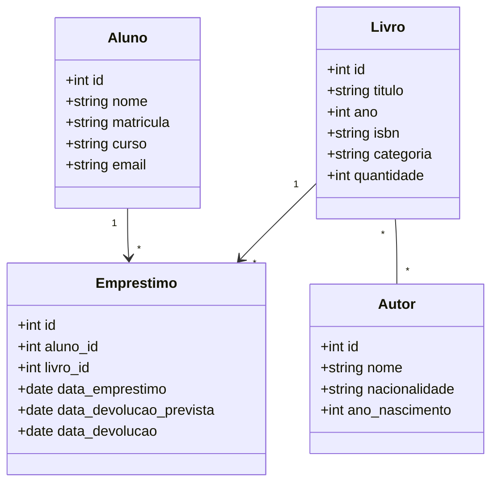

# Diagrama de Classes - Sistema de Biblioteca

```mermaid
classDiagram

    class Emprestimo {
        +int id
        +int aluno_id
        +int livro_id
        +date data_emprestimo
        +date data_devolucao_prevista
        +date data_devolucao
    }
    
    class Livro {
        +int id
        +string titulo
        +int ano
        +string isbn
        +string categoria
        +int quantidade
    }

    class Autor {
        +int id
        +string nome
        +string nacionalidade
        +int ano_nascimento
    }

    class Aluno {
        +int id
        +string nome
        +string matricula
        +string curso
        +string email
    }

    %% Relacionamentos
    
    %% 1 Livro pode ter vários registros de empréstimo
    Livro "1" --> "*" Emprestimo
    
    %% 1 Aluno pode realizar vários empréstimos
    Aluno "1" --> "*" Emprestimo
    
    %% Relacionamento Muitos-para-Muitos (Conceitual)
    Livro "*" -- "*" Autor 
```
